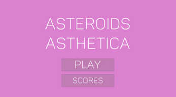
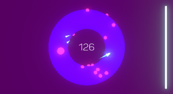

# Asteroids Asthetica
 
Asteroids on a torus!

This game was made in 3 days for Longgame Tech Innovation's [Innovation Jam 12](https://itch.io/jam/longgame-tech-innovation-jam-12-torus).

Play on itch.io [here](https://sappyjam.itch.io/asteroids-asthetica)!

 

## About

In classic Asteroids, the player controls a spaceship and destroys as many flying asteroids as possible without getting hit. 
The spaceship moves along a 2D plane that wraps back on itself.
  
In this variant of the classic game Asteroids, the spaceship moves on the surface of a torus, another word for a donut.
  
This project was a fun exercise in mathematics, as I had to determine the paramaterization of the surface of a torus as well as its normals. 
This was also my first time using Unity's 3D engine to develop a game.
  

## Screenshots

  

## Resources Used
Game engine: Unity  
["Panton" font from www.fontfabric.com](https://www.fontfabric.com/fonts/panton/)  
["laser3" by nsstudios](https://freesound.org/people/nsstudios/sounds/344276/)  
["Explosion Sound" by Davidsraba](https://freesound.org/people/Davidsraba/sounds/347168/)  
["Explosion02.wav" by jeremysykes](https://freesound.org/people/jeremysykes/sounds/341237/)  
["Rocket Boost Engine Loop.wav" by qubodup](https://freesound.org/people/qubodup/sounds/146770/)  
["Ambient Piano Music #2" by Lemoncreme](https://freesound.org/people/Lemoncreme/sounds/320525/)  
["Lo-fi Music Guitar (Loop)" by Migfus20](https://freesound.org/people/Migfus20/sounds/569791/)  
["Peaceful Ambiance Music" by TheoTur](https://freesound.org/people/TheoTer/sounds/510948/)  